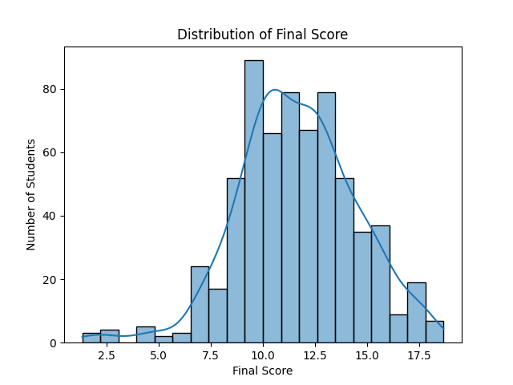
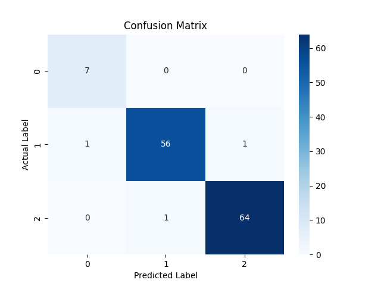
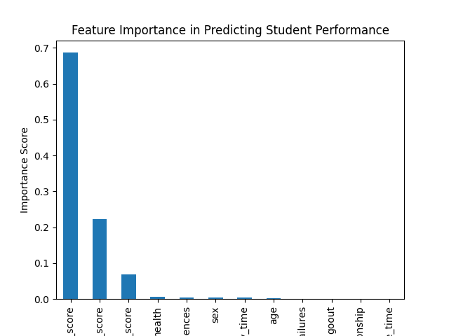

<<<<<<< HEAD

Student Performance Prediction(Machine Learning)

# Project Overview 
This Projetc predicts student Performance categories (low,medium ,high) using the machine learning techniques.

## Technologies Used
-Python
-Pandas
-Numpy
-Matplotlib
-seaborn
-Sckit-learn
## Machine Learning Model
Decision Tree Classifier

## Accuracy 
97.7%

#FEATURES USED
-Study Time
-Failures
-Absences
-Family relationship
-Free Time
-Health
-Exam scores

 #Steps Performed 
 1.Data cleaning
 2.Feature engineering
 3.Exploratory data analysis
 4.Performance categorization
 5.Machine Learning model Training
 6.Model Evaluation uisng accuracy and confusion Matrix
 

##Visualization
-Score distribution 

-Performance categories

-Confusion matrix 

-Feature Importance 

=======

